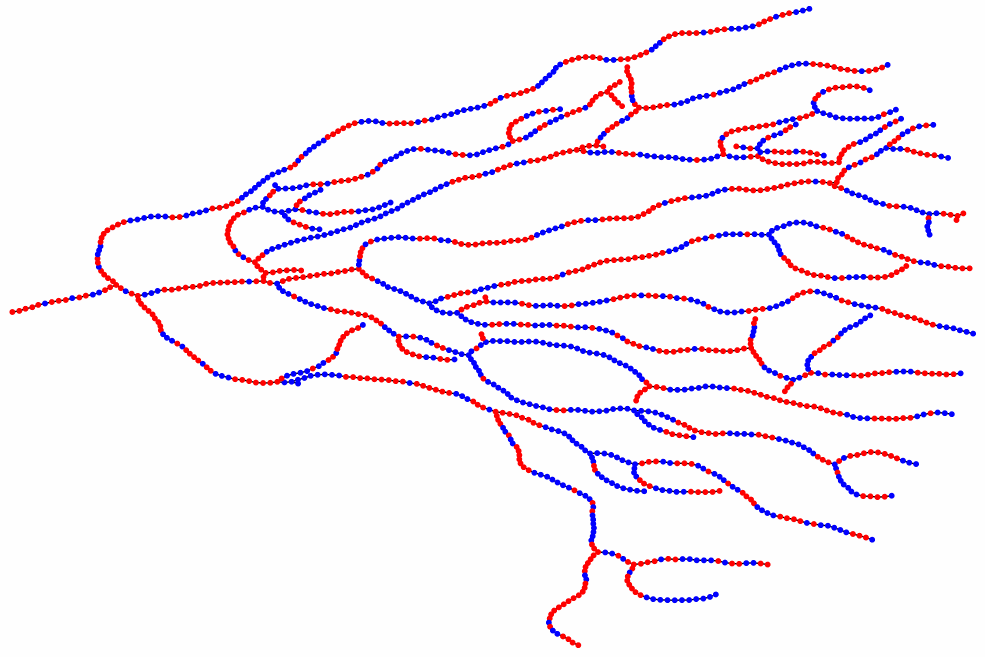
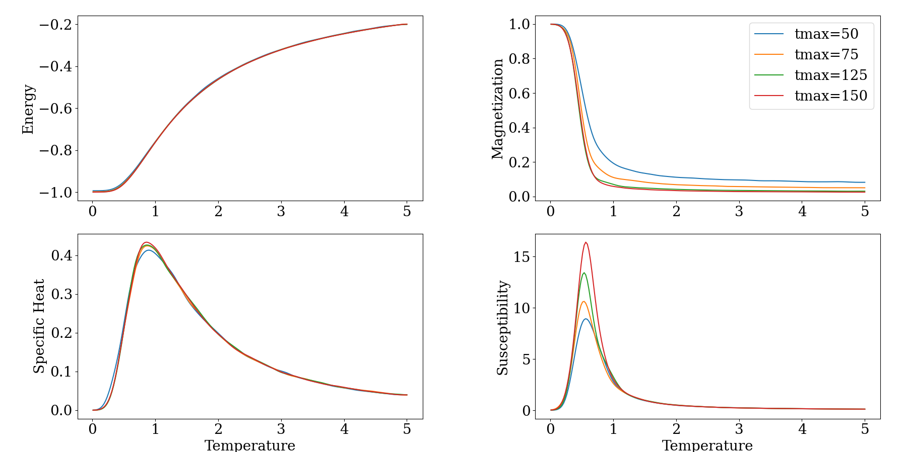

# Tumor Ising model

The main biologically motivated question this project tries to answer is:  
What behavior does the Ising model exhibit on a biological branching topology?

## Project structure
There are 3 main components:  

1. **Topology Generation**
    - Generation of branching morphogenesis graphs

2. **Ising model simulations**
    - Implementation of the Ising model on the generated topologies
    - Simulation of 'cell' interactions and state changes

3. **Analysis** (In Progress)
    - Calculating relevant graph statistics
    - Evaluation of critical exponents

**Other features:**
- Dimensional crossover by stacking branching topologies
- Ising model on time-evolving branches

This project is implemented in python using numba and JIT compiling. If needed in the future, a C++ version will be made.

## Visualisation

<em>1.Generation of Branching morphogenesis</em>

<em>2.Ising model simulation</em>

<em>3. Global Ising model statistics</em>

