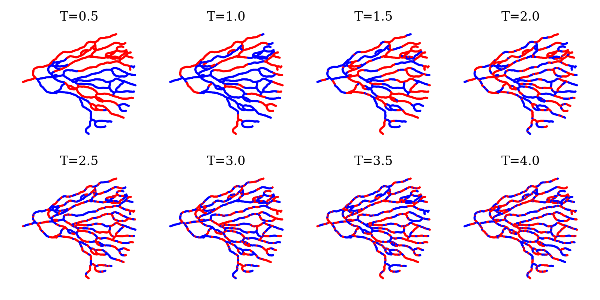
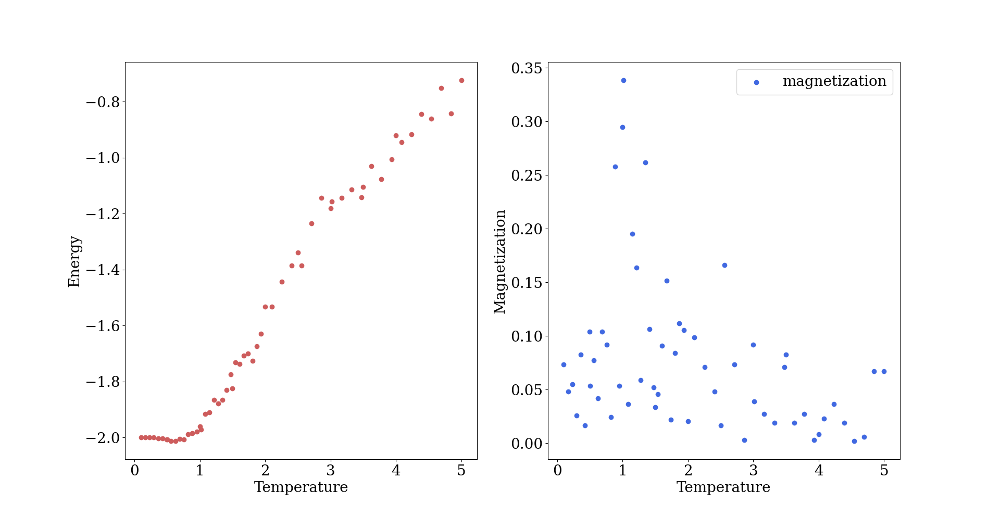
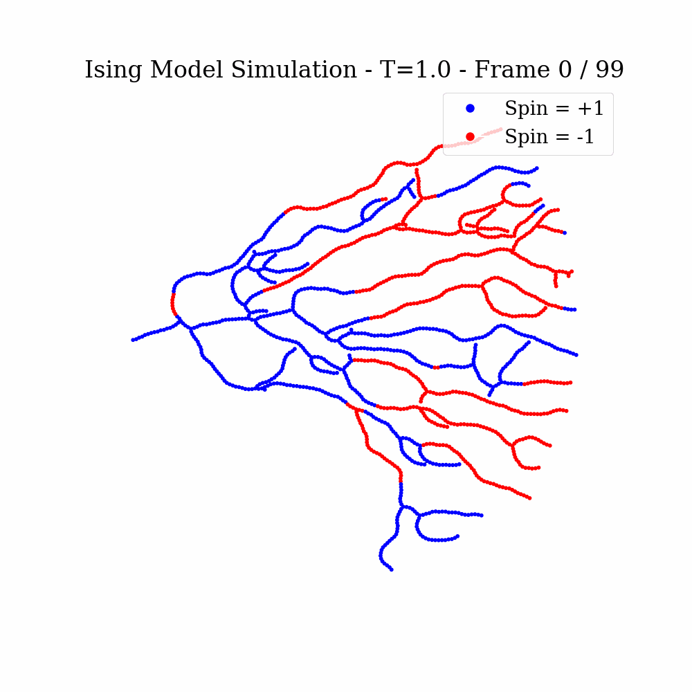
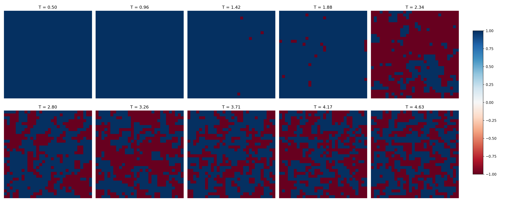
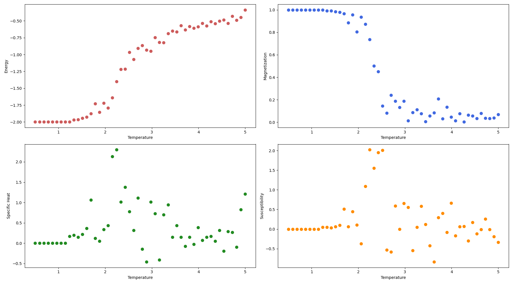

# Tumor Ising model

This code consist of 3 main steps:  
1. Generating the topology
2. Running the Ising model
3. Analysis of the Ising model results (TO DO)

## Results: Branching 








## Results: Grid 




## Background: The Ising model in physics

The Ising model was first introduced in the 1920s by Ernest Ising, which concerns itself with the physics of phase transitions. More specifically the model was originally used to obtain a better understanding of ferromagnetism and especially "spontaneous magnetization".

The first component of the Ising model is the topology structure. The classical starting point would be a 2D lattice with "wrap around" boundary conditions which turns it into a torus. Each lattice site is assigned an independent variable $\sigma_i$ for $i=1,...,N$.
The independent variables $\sigma_i$ can be in 2 possible states, $\sigma_i = \pm 1$ reflecting the physical assumption that only 2 possibilities exist such as spin up/down(Potts model generalizes to multiple states). Assigning each lattice point a state gives us a configuration fo the system $(\sigma_1,..., \sigma_N)$.    

A second component is called the *Hamiltonian* function which denotes the energy of a configuration $\sigma$. The Ising Hamiltoniain is formulated as follows:  
```math
H(\sigma) = -\sum_{\langle i,j\rangle} J_{i,j} \sigma_i \sigma_j - \mu \sum
```


1D results: each site only interacts with its left and right neighbor -> no phase transition.


## Requirements
